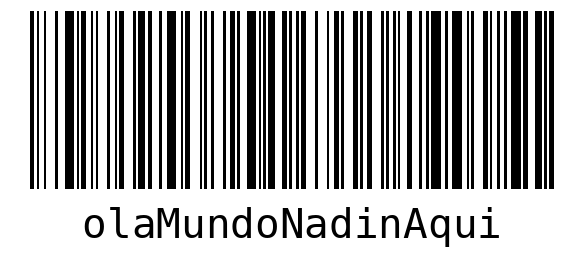

# Rocketseat Python Project  

### Projeto da Rocketseat NLW - Python 

Projeto de Python da Rocketseat,utilizamos o virtualenv para a criação de ambiente virtual além de configura o pylint para padronização do projeto. 
E tem um plus de boas práticas de desenvolvimento, tratativas de erros, validações de dados de entrada e teste unitário.

O Projeto utiliza:

- **Virtualenv**
- **pylint**
- **pytest**
- **nodeenv**
- **Flask**
- **pillow**
- **Cerberus**

## Exemplo
### Código de Barra

